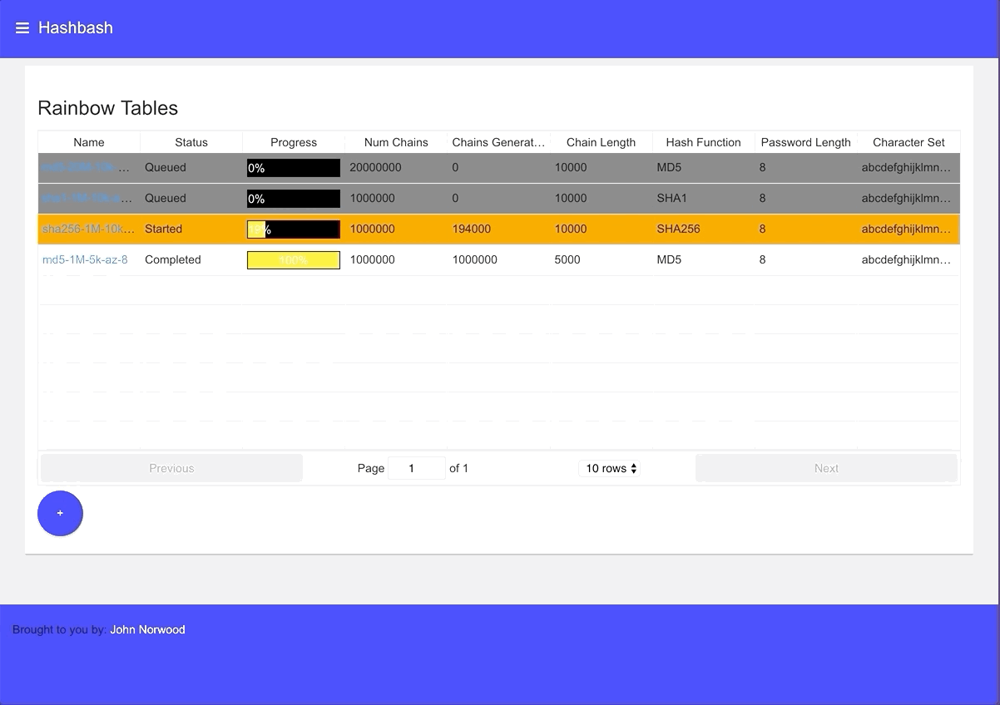

Hash Bash Frontend
==================


This codebase houses the frontend code for the hashbash application. The frontend is built in
[react](https://reactjs.org/). This codebase produces a single artifact necessary to the
deployment of the hashbash application, the `hashbash/nginx` docker image. This image
contains the "compiled" javascript, css, and images for the application, as well as the nginx
config to serve up these assets and to direct API calls to the backend server, of which
there are two versions.

I wrote a version of the hashbash backend in [go](https://github.com/norwoodj/hashbash-backend-go), and
one in [java](https://github.com/norwoodj/hashbash-backend-java). My reasons for writing this project
were mainly for fun and to gain experience in each of these languages and related libraries, but also
to compare the relative performances of the application in each language.

I summarized the results of this comparison in a [blog post](https://medium.com/@norwood.john.m/hashbash-a-comparison-of-cpu-and-io-bound-applications-in-go-and-java-across-multiple-metrics-d358df6e03b1).


### Building and Developing Locally
In order to build, run and develop this project locally you'll need a number of things installed:

* docker
* docker-compose
* make

To build the docker image:
```
make
```

To run the application locally, rebuilding frontend assets on changes:
```
make run
```

To publish the docker images:
```
make push
```
